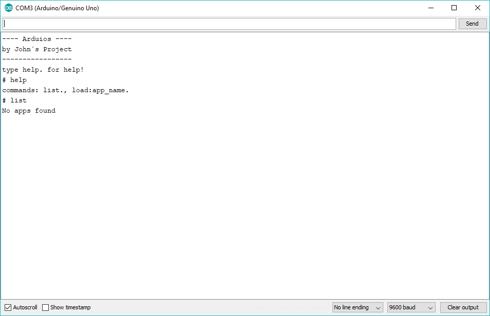

# Arduios
Arduios is like a operating system for the arduino, it enables you to use a sketch in different use cases, without having to upload a new one every time.

## Usage
It's very simple to use the Arduios, as it has a simple shell app that enables you to communicate with it through the serial monitor of the Arduino IDE.

The Commands are
```
help. - shows all available commands
list. - shows all available apps
load:app_name. - loads an app from registry
```
Note that theres alway a point behind them. This is needed because of the way the shell works.

## Creating your own apps
It's also very simple to create your own apps using the Arduios.

First you need to download the repository, with that done, open the ``Arduios.ino`` file with the Arduino IDE.
Now add a new file to the sketch called ``TestApp.h ``.

This is how a basic Arduios app looks like
```c++
#include "Kernel.h"

class TestApp: public App {
    
    String getName() {
      // return your apps name here
      return "TestApp";
    }
    
    void setup() {
      // put your setup code here, to run once:
      Serial.println("TestApp begin");
    }
    
    void loop() {
      // put your main code here, to run repeatedly:
      Serial.println("TestApp loop");
      delay(1000);
    }
    
} testApp;
```

To finish edit the Arduios file, by adding ``#include "TestApp.h"`` and ``testApp`` to the apps array.

Congrats! you've just created your first Arduios app.

## Screenshot

